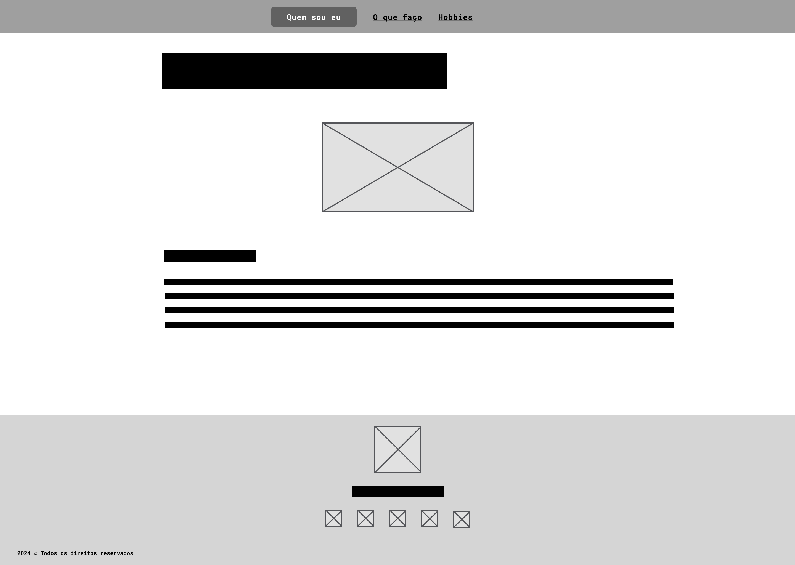
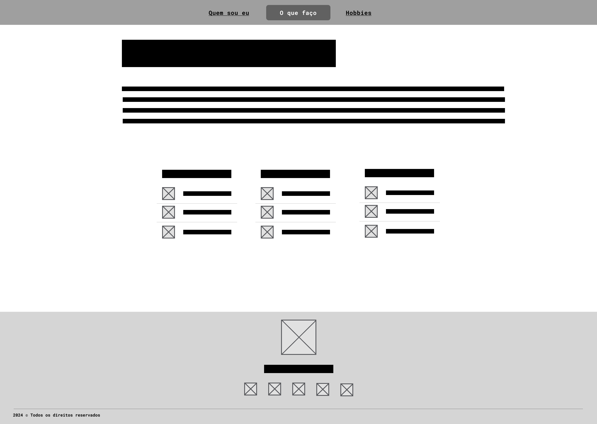
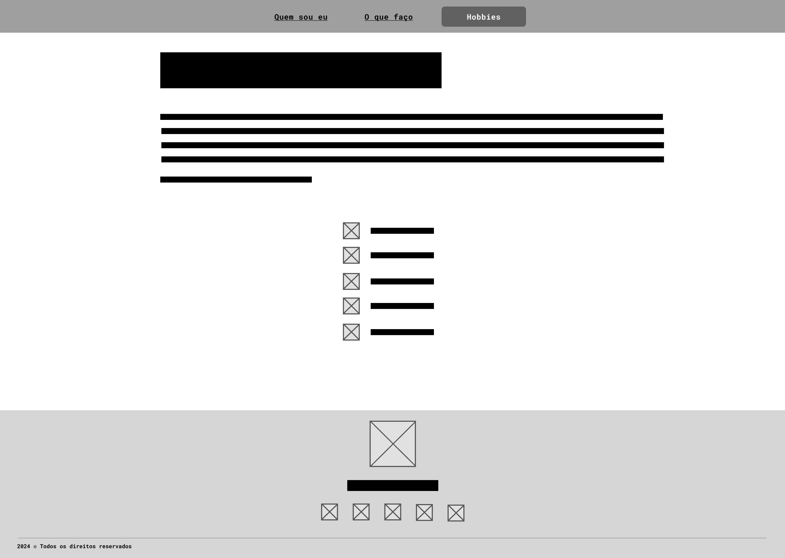
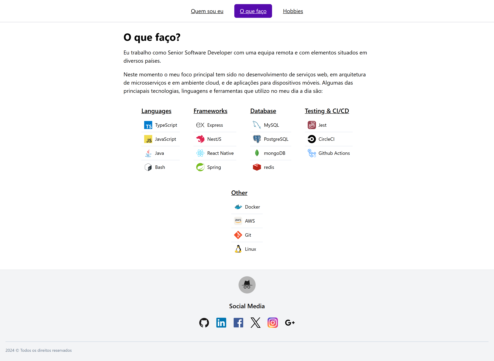
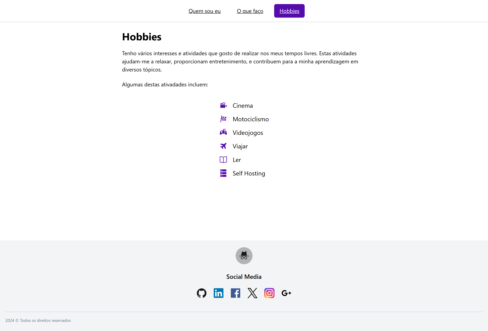

# MiniProj1

Mini Projeto 1, tarefa 2.2 da UC Programação Web Avançada do Mestrado em Engenharia Informártica e Tecnologia Web.

**Índice**

- [Project Setup](#project-setup)
- [Wireframes](#wireframes)
- [Screenshots](#screenshots)

## Project Setup

Como preparar o ambiente e correr o projeto

### Install dependencies

Run `yarn` OR `npm install`

### Compile and Hot-Reload for Development

Run `yarn dev` OR `npm run dev`

### Type-Check, Compile and Minify for Production

Run `yarn build` OR `npm run build`

Optionally, preview the production build by running `yarn preview` OR `npm run preview` after the build.

### Lint with [ESLint](https://eslint.org/)

Run `yarn lint` OR `npm run lint`

## Wireframes

Wireframe página **"Quem sou eu"**

Wireframe página **"O que faço"**

Wireframe página **"Hobbies"**

## Screenshots

Página **"Quem sou eu"**

Página **"O que faço"**

Página **"Hobbies"**

